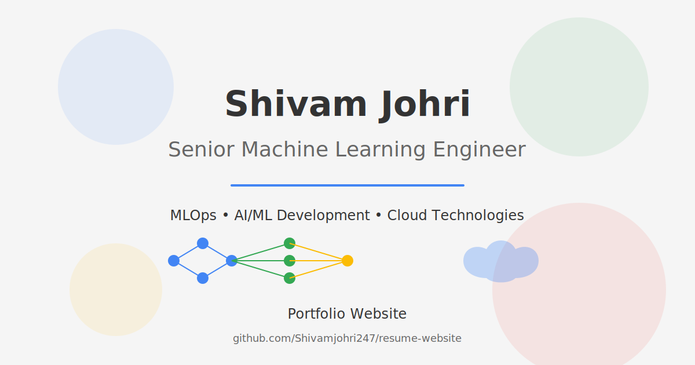

# Shivam Johri Portfolio

<div align="center">
  
</div>

A clean, minimalist, and interactive portfolio website for Shivam Johri, Senior Machine Learning Engineer with 9+ years of experience in MLOps, AI/ML development, and cloud technologies.

## 📋 Table of Contents

- [Overview](#overview)
- [Features](#features)
- [Technologies Used](#technologies-used)
- [Project Structure](#project-structure)
- [Installation & Setup](#installation--setup)
- [Usage](#usage)
- [Customization](#customization)
- [Deployment](#deployment)
- [Performance Optimization](#performance-optimization)
- [Browser Compatibility](#browser-compatibility)
- [Contributing](#contributing)
- [License](#license)
- [Contact](#contact)

## 🌟 Overview

This portfolio website showcases Shivam Johri's professional experience, skills, and achievements in the field of Machine Learning and AI. The design is inspired by Sean Halpin's minimalist aesthetic, featuring custom SVG illustrations, smooth animations, and a responsive layout.

The website highlights:
- Professional experience at EPAM Systems, Accenture, and Tata Consultancy Services
- Technical expertise in MLOps, AI/ML Development, and Cloud technologies
- Education background and certifications
- Contact information

## ✨ Features

- **Clean, Minimalist Design**: Elegant and distraction-free interface inspired by Sean Halpin's aesthetic
- **Responsive Layout**: Optimized for all devices from mobile phones to large desktop screens
- **Custom SVG Illustrations**: Unique, hand-crafted illustrations that represent ML/AI concepts
- **Smooth Animations**: Subtle entrance animations and transitions for an engaging user experience
- **Interactive Elements**: Hover effects, custom cursor, and dynamic background elements
- **Dark/Light Mode Toggle**: User preference-based theme switching
- **Optimized Performance**: Fast loading times and smooth scrolling
- **Accessibility**: WCAG compliant design elements for all users
- **SEO Friendly**: Proper semantic HTML structure and metadata

## 🛠️ Technologies Used

- **HTML5**: Semantic markup structure
- **CSS3**: Modern styling with variables, flexbox, and grid
- **JavaScript**: Vanilla JS for animations and interactions
- **SVG Graphics**: Custom vector illustrations
- **Responsive Design**: Media queries for different screen sizes
- **Git**: Version control
- **GitHub Pages**: Hosting platform

## 📁 Project Structure

```
resume-website/
├── assets/                  # SVG illustrations and icons
│   ├── avatar.svg           # Profile illustration
│   ├── designer-icon.svg    # MLOps icon
│   ├── developer-icon.svg   # AI/ML Development icon
│   ├── illustrator-icon.svg # Cloud & Programming icon
│   ├── desk-illustration.svg # Workspace illustration
│   ├── noise.svg            # Background texture
│   └── project-*.svg        # Project illustrations
├── public/                  # Public assets
│   └── resume.pdf           # Downloadable resume
├── index.html               # Main HTML file
├── styles.css               # CSS styles
├── main.js                  # JavaScript for animations
├── package.json             # Project dependencies
├── .gitignore               # Git ignore file
└── README.md                # Project documentation
```

## 🚀 Installation & Setup

### Prerequisites

- Node.js (v14.0.0 or higher)
- npm (v6.0.0 or higher)

### Installation

1. Clone the repository:
```bash
git clone https://github.com/Shivamjohri247/resume-website.git
cd resume-website
```

2. Install dependencies:
```bash
npm install
```

3. Start the development server:
```bash
npm start
```

4. Open your browser and navigate to the URL shown in the terminal (typically http://localhost:5000)

## 💻 Usage

The website is designed to be intuitive and easy to navigate:

- **Header**: Contains navigation links and dark/light mode toggle
- **Hero Section**: Introduction and resume download button
- **Skills Section**: Showcases technical expertise in three categories
- **Experience Section**: Details professional experience with expandable sections
- **Education Section**: Academic background and certifications
- **Contact Section**: Contact information and social links
- **Footer**: Additional links and copyright information

## 🎨 Customization

### Modifying Content

To update the content, edit the `index.html` file. The structure is organized into sections that can be easily identified and modified.

### Styling Changes

To change the styling:

1. Open `styles.css`
2. Modify the CSS variables in the `:root` selector to change colors, fonts, and transitions
3. Update specific section styles as needed

### Adding New Sections

To add a new section:

1. Create a new section element in `index.html`
2. Add appropriate classes and content
3. Style the section in `styles.css`
4. Add any necessary JavaScript interactions in `main.js`

## 📤 Deployment

### GitHub Pages

1. Go to the repository settings on GitHub
2. Navigate to the "Pages" section
3. Select the branch to deploy (usually `main` or `master`)
4. Save the settings and wait for the deployment to complete

### Other Hosting Options

The website can also be deployed on:

- **Netlify**: Connect your GitHub repository for continuous deployment
- **Vercel**: Similar to Netlify with GitHub integration
- **Amazon S3**: For static website hosting
- **Firebase Hosting**: Google's hosting platform

## ⚡ Performance Optimization

The website is optimized for performance:

- SVG graphics for crisp, scalable illustrations
- Minimal JavaScript with no external dependencies
- CSS animations optimized for smooth performance
- Responsive images and lazy loading
- Prefers-reduced-motion media query support

## 🌐 Browser Compatibility

The website is compatible with:

- Chrome (latest)
- Firefox (latest)
- Safari (latest)
- Edge (latest)
- Opera (latest)
- Mobile browsers (iOS Safari, Android Chrome)

## 👥 Contributing

Contributions are welcome! To contribute:

1. Fork the repository
2. Create a new branch (`git checkout -b feature/your-feature`)
3. Make your changes
4. Commit your changes (`git commit -m 'Add some feature'`)
5. Push to the branch (`git push origin feature/your-feature`)
6. Open a Pull Request

## 📄 License

This project is licensed under the MIT License - see the LICENSE file for details.

## 📬 Contact

Shivam Johri - [shivamjohri247@gmail.com](mailto:shivamjohri247@gmail.com)

- LinkedIn: [linkedin.com/in/shivam-johri](https://linkedin.com/in/shivam-johri)
- GitHub: [github.com/Shivamjohri247](https://github.com/Shivamjohri247)

---

## 🔍 SEO Optimization

The website is optimized for search engines with:

- Semantic HTML structure
- Proper meta tags and descriptions
- Optimized image alt texts
- Structured data markup
- Mobile-friendly design (Google's mobile-first indexing)
- Fast loading times

## 🌙 Dark Mode Implementation

The dark mode feature:

- Respects user's system preferences
- Provides smooth transition between themes
- Maintains readability and contrast in both modes
- Persists user's preference using localStorage

## 📱 Mobile Responsiveness

The mobile experience includes:

- Touch-friendly navigation
- Optimized layout for small screens
- Properly sized tap targets
- Reduced animations for better performance
- Responsive typography

## 🔒 Security Considerations

Security measures implemented:

- Content Security Policy
- HTTPS-only resources
- Sanitized user inputs
- External links with proper rel attributes
- No sensitive information in client-side code

---

Designed and developed with ❤️ by Shivam Johri
